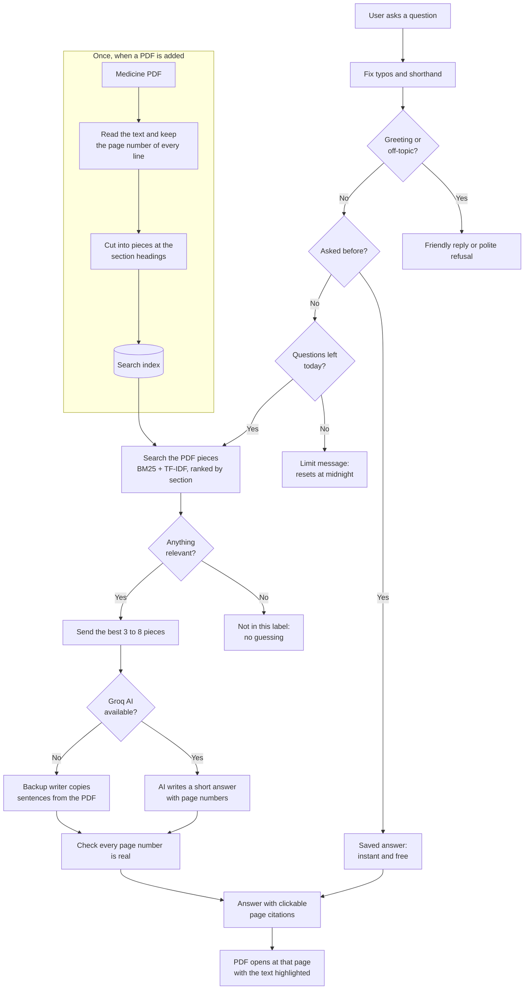
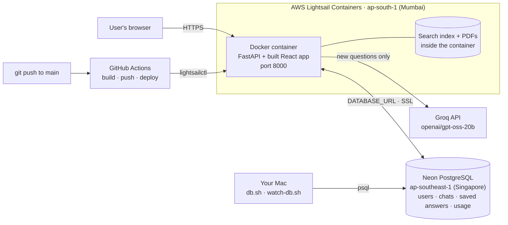

# MedCite — Drug Information Q&A Chatbot with Citations

MedCite answers questions about medicines using **only** official medicine PDFs, and shows the page for
every fact. If the PDF does not say it, MedCite says so instead of guessing.

Built for the Cognizant and GITAM student buildathon (use case 7) · GenAI / RAG / Responsible AI.

---

## How it works



The search decides what is true; the AI only writes it in plain English.
Nothing is trained or memorised, so a new PDF works straight away.

---

## Features

- Answers from the official label only, with a page citation for every fact
- Click a citation: the PDF opens beside the chat at that page, text highlighted
- Refuses off-topic questions; advice questions get the label text plus "ask a doctor"
- Understands typos and shorthand (`wht`, `tht`, `pregent`, `shud`)
- 13 built-in medicines for every user, plus private uploads
- Uploads accepted only from rxabbvie.com, verified by the PDF's link
- 30 AI questions per user per day; questions asked before are answered free from the database

---

## Quick start

**Docker**

```
git clone https://github.com/Boi-Talk13/Drug-Information-Q-A-Chatbot.git
cd Drug-Information-Q-A-Chatbot
cp .env.example .env          # put your Groq key in AI_API_KEY
docker compose up --build     # open http://localhost:3000
```

**For development**

```
pip install -r backend/requirements.txt
python3 -m uvicorn backend.api.main:app --port 8000   # backend, runs in the background

cd frontend && npm install && npm run dev      # open http://localhost:3000
```

After pulling changes to the PDFs or the text splitter, rebuild the index: `python3 -m backend.build_index`.
All settings and their defaults are explained in `.env.example`.

---

## AI and its limits

MedCite uses `openai/gpt-oss-20b` on Groq. The free plan's limits belong to the whole Groq account:

| Limit (free plan) | What it means |
|---|---|
| 200,000 tokens a day | About **170 AI answers a day**, shared by all users |
| 8,000 tokens a minute | About **7 AI answers a minute**; more than that waits ~15–20 s |

- Each question uses about 1,150 tokens, because only the best 3–8 PDF pieces are sent.
- If Groq cannot answer, a **backup writer** copies the matching sentences from the PDF. It is free and
  fast, but less clear.
- Groq's paid plan removes the problem: about $1.70 a month for 500 questions a day.

---

## Adding a medicine PDF

1. Click **Upload PDF** and paste the official link, e.g. `https://www.rxabbvie.com/pdf/rinvoq_pi.pdf`
2. Choose **that same file**. The file name must match the link.

A PDF is rejected if the link is not rxabbvie.com, is not in the site's list of 280 PDFs, does not match
the file, or the file is not a medicine label. Refresh the list with
`python3 -m backend.sources.rxabbvie --refresh`.

---

## Testing

```
python3 -m tests.test_daily_limit                 # daily limit + saved answers (no AI tokens)
python3 -m tests.evaluate                         # accuracy on the main question set
python3 -m tests.evaluate --file holdout.json     # questions never used for tuning
python3 -m tests.evaluate --file tough.json       # all 13 PDFs, typos, specific facts
python3 -m tests.build_answer_keys                # rebuild answer keys from the PDFs
```

| Check | Result |
|---|---|
| Page numbers correct across all PDF pieces | **99.8%** |
| Right page sent to the AI (85 labeled questions) | **81 / 85 (95.3%)** — main 25/25, held-out 21/21, tough 35/39 |
| Off-topic refusal (tough set) | F1 **0.909**, never refused a real question |
| Daily limit test | **21 / 21** checks pass |

Answer keys are built from the PDFs themselves, never from MedCite's answers. The full AI accuracy
test (citation F1) will be re-run on the current version when the Groq daily limit allows.

---

## Deployment (AWS)

**Live URL:** https://medcite.ft97gngrew9p0.ap-south-1.cs.amazonlightsail.com/

### Architecture



- **One Docker image** holds everything the app runs: the React frontend is built in a Node stage and
  served by FastAPI from the same container, so there is one process, one port, one thing to deploy.
- **Lightsail Containers** runs that image and gives the public HTTPS URL.
- **Neon PostgreSQL** stores everything that must survive a redeploy: users, chat history, saved answers
  and daily usage. It lives outside the container, so a new deployment never wipes it.
- **Groq** is only called for a question nobody has asked before; a repeated question is answered from
  the saved answers in Neon without using the API key.
- **GitHub Actions** rebuilds and redeploys the container on every push to `main`.

Deployed as a single container on **AWS Lightsail Containers** (`ap-south-1`) — chosen over EC2/ECS/App
Runner because it needs no VPC, load balancer, or server patching, and gives a public HTTPS URL as soon
as the container is created. App Runner was tried first but the account had no service subscription for
it in any region; Lightsail Containers was the simplest working alternative.

**Tools used:** Docker Desktop (multi-stage build — `node:20-slim` builds the React frontend,
`python:3.12-slim` serves it via FastAPI/uvicorn on port 8000), AWS CLI, the `lightsailctl` plugin
(`brew install aws/tap/lightsailctl`) that `aws lightsail push-container-image` needs, and a free
**Neon PostgreSQL** database for the app's data (see [Database](#database-neon-postgresql) below).

Steps, run from the project root:

```bash
# 1. Build the image for the deployment architecture (Macs with Apple Silicon need --platform)
docker build --platform linux/amd64 -t medcite:latest .

# 2. Create the container service (one-time; assigns the public HTTPS URL)
aws lightsail create-container-service --service-name medcite --power small --scale 1 --region ap-south-1

# 3. Push the image into that service's private registry
aws lightsail push-container-image --region ap-south-1 --service-name medcite \
  --label medcite --image medcite:latest
# → prints an image ref like ":medcite.medcite.N" — use the latest N below

# 4. Deploy: point the service at the pushed image, open port 8000, set env vars
aws lightsail create-container-service-deployment --region ap-south-1 --cli-input-json '{
  "serviceName": "medcite",
  "containers": {
    "medcite": {
      "image": ":medcite.medcite.N",
      "ports": { "8000": "HTTP" },
      "environment": {
        "AI_API_KEY": "<your Groq key>",
        "DATABASE_URL": "<your Neon connection string>",
        "AI_MODEL": "openai/gpt-oss-20b",
        "AI_BASE_URL": "https://api.groq.com/openai/v1",
        "DAILY_QUESTION_LIMIT": "30",
        "USAGE_TIMEZONE": "Asia/Kolkata",
        "PDF_FOLDER": "/app/data/pdfs",
        "INDEX_FOLDER": "/app/data/index"
      }
    }
  },
  "publicEndpoint": {
    "containerName": "medcite",
    "containerPort": 8000,
    "healthCheck": { "path": "/", "successCodes": "200-499" }
  }
}'
```

Manually, redeploying after a code change means repeating steps 1, 3, and 4 (bump the image label
number). With the CD pipeline below in place, this happens automatically on every push to `main`.

### CD pipeline (GitHub Actions)

[.github/workflows/deploy.yml](.github/workflows/deploy.yml) runs the four steps above automatically on
every push to `main` (and via a manual "Run workflow" button):

1. Build the image (`docker build --platform linux/amd64`)
2. Install `lightsailctl` on the runner
3. Push the image to the Lightsail service, capturing the new image ref (`:medcite.medcite.N`)
4. Deploy that ref with the same env vars as the manual command, then poll
   `get-container-services` until the new revision is `RUNNING`/`ACTIVE`

It deploys with a dedicated, least-privilege IAM user (`medcite-ci`) — not a personal AWS key — scoped to
only: `lightsail:PushContainerImage`, `CreateContainerServiceDeployment`, `GetContainerServices`,
`GetContainerImages`, `RegisterContainerImage`, `CreateContainerServiceRegistryLogin` (the last one is
what lets `lightsailctl` log in to push the image — without it the push fails with AccessDenied).

**One-time setup**, in the GitHub repo's Settings → Secrets and variables → Actions, add:

| Secret | Value |
|---|---|
| `AWS_ACCESS_KEY_ID` | Access key for the `medcite-ci` IAM user |
| `AWS_SECRET_ACCESS_KEY` | Secret key for the `medcite-ci` IAM user |
| `GROQ_API_KEY` | The Groq key (becomes `AI_API_KEY` in the container) |
| `DATABASE_URL` | The Neon PostgreSQL connection string (becomes `DATABASE_URL` in the container) |

Create that IAM user's credentials with:

```bash
aws iam create-user --user-name medcite-ci
aws iam put-user-policy --user-name medcite-ci --policy-name medcite-ci-lightsail --policy-document '{
  "Version": "2012-10-17",
  "Statement": [{
    "Effect": "Allow",
    "Action": [
      "lightsail:PushContainerImage",
      "lightsail:CreateContainerServiceDeployment",
      "lightsail:GetContainerServices",
      "lightsail:GetContainerImages",
      "lightsail:RegisterContainerImage",
      "lightsail:CreateContainerServiceRegistryLogin"
    ],
    "Resource": "*"
  }]
}'
aws iam create-access-key --user-name medcite-ci   # copy AccessKeyId/SecretAccessKey into the secrets above
```

Once the four secrets exist, push to `main` and check the **Actions** tab for the `Deploy to AWS
Lightsail` run.

### Database (Neon PostgreSQL)

The deployed app stores its data in a free **Neon PostgreSQL** database, not inside the container.

**Why Neon:** a Lightsail container has no persistent disk, so a database file inside it (the SQLite
fallback) is wiped on every redeploy and can't be looked at from outside. Neon is a hosted Postgres with a
free plan, so the data survives every deployment and can be browsed from any machine. It runs in
**AWS Singapore (`ap-southeast-1`)** — Neon has no Mumbai region, and Singapore is the closest to the app.

**How the app picks the database:** if `DATABASE_URL` is set (and the `psycopg2-binary` driver is
installed, which it is in `backend/requirements.txt`), the backend uses Postgres. If it isn't set, or
Postgres can't be reached, it falls back to SQLite automatically (`backend/api/db.py`). The tables are
created on first start — nothing to set up by hand.

**What is stored:**

| Table | What it holds |
|---|---|
| `users` | Each browser's random token and its short id (`user-101`, `user-102`, ...) |
| `chat_history` | Every question and answer, with citations, medicine, user and time |
| `answers` | Monitoring log: response time, pages cited, refused or not, AI or backup writer |
| `answer_cache` | Saved AI answers — a repeated question is answered from here, no Groq call |
| `daily_usage` | AI answers each user got per day (the 30-a-day limit) |

**Setup:** create a project on [neon.tech](https://neon.tech) (region: AWS Asia Pacific 1, Singapore),
copy the connection string from **Connect**, and add it as the `DATABASE_URL` GitHub secret. The next
deploy connects to it.

**Look at the live data from your Mac** (needs `psql`: `brew install postgresql`):

```bash
# live view: newest 50 rows, refreshes every 10 seconds (Ctrl+C to stop)
DB="<your Neon connection string>" bash watch-db.sh

# look things up: overview, today, one user, one medicine, refusals, one full row
DB="<your Neon connection string>" bash db.sh
DB="<your Neon connection string>" bash db.sh today
```

Times are shown in India time. Neon itself runs in UTC and its connection pooler ignores session time zone
settings, so both scripts convert each timestamp inside the query.

**Known limits of this setup:**
- The search index and user-uploaded PDFs still live inside the container, so uploads are lost on a
  redeploy. The 13 built-in PDFs are part of the image and come back automatically.
- Neon's free plan has 0.5 GB of storage and pauses the database when idle, so the first question after a
  quiet spell can take a moment longer while it wakes up.
- Secrets (the Groq key, the database URL) are passed as plain deployment environment variables, not a
  secrets manager — fine for a demo, not for production.

An older plan to deploy on a plain EC2 instance with `docker compose up` is kept at
[docs/aws-deploy.md](docs/aws-deploy.md) for reference, but Lightsail Containers is what is actually
running at the URL above.

---

## Project structure

```
backend/
  api/          web API and database (users, chats, saved answers, daily usage)
  ai_answer/    one question end to end: search, AI answer, page checks, safety
  search/       BM25 + TF-IDF search, section ranking, typo fixes
  pdf_reader/   reads PDFs with page numbers, cuts them into pieces
  sources/      upload check against rxabbvie.com
frontend/src/   chat screen, PDF viewer, upload dialog
data/pdfs/shared/   the 13 built-in medicine PDFs
tests/          question sets, accuracy scoring, daily-limit test
docs/           AWS deployment guide
db.sh, watch-db.sh  browse and watch the chat database (local, or Neon with DB=...)
```

---

## Safety

- If the search finds nothing, the AI is never asked to guess.
- Every page number is checked against the text actually sent to the AI.
- A question about one medicine is never answered from another medicine's PDF.
- One user never sees another user's uploads or chats.
- Instructions hidden inside a PDF are ignored; PDF text is data, not orders.
- The API key lives only in `.env`, which is never committed.

**Known weak spots:** a question whose words happen to appear in labels can slip past the off-topic check
("what is 25 times 17?"); answers inside dosage tables can miss the right page; uploads briefly slow other
users; heavy use on the free Groq plan falls back to backup answers.

---

## Team

| Part | Who | Job |
|---|---|---|
| Front end | Puspha | Builds the chat screen — the question box, the answer area, and the little page-number tags next to each fact |
| Front end | Harshitha | Builds the PDF viewer beside the chat, so clicking a page number opens that exact page of the PDF |
| Front end | Soundrya | Builds the upload button, the list of medicines we already have, and shows the refusal and warning messages clearly |
| Back end | Yaswanth | Reads the text out of the PDFs, keeps the page number of every line, and cuts each PDF into pieces by section |
| Back end | Mahadev | Builds the search, mixes the two search types together, and tunes it so the right piece comes first |
| Back end | Bhavesh | Writes the instructions we give the AI, joins short follow-up questions to the earlier chat, makes the bot refuse when there is no proof, and checks every page number is real |
| Back end | Tejas | Builds the API and the database, puts it online for the demo, runs the monitoring dashboard, and keeps the cost low |
| Lead — both sides | Maithryi | Joins the front end and back end together, writes the 60 test questions and scores them, and tells the story on demo day |

Data: free public prescribing information from [rxabbvie.com](https://www.rxabbvie.com/).
Example of a link MedCite accepts for upload: https://www.rxabbvie.com/pdf/linzess_pi.pdf (LINZESS)
MedCite is a document lookup tool, not a doctor: it never tells anyone what to take.
