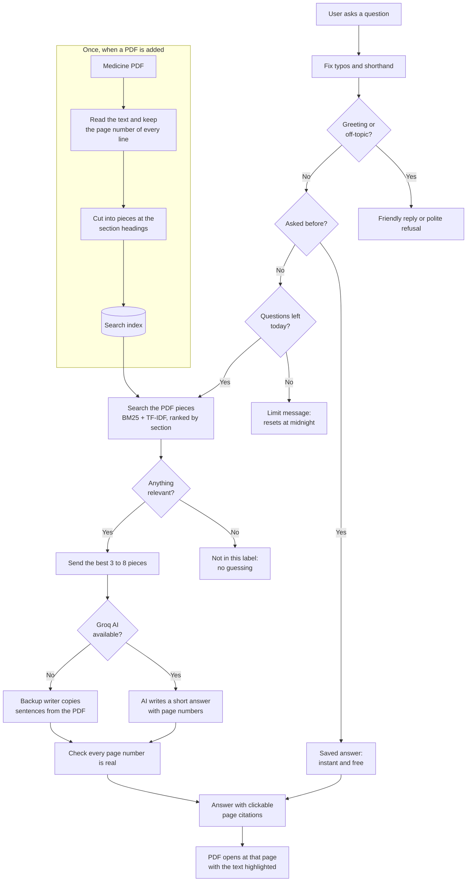

# MedCite — Drug Information Q&A Chatbot with Citations

MedCite answers questions about medicines using **only** official medicine PDFs, and shows the page for
every fact. If the PDF does not say it, MedCite says so instead of guessing.

Built for the Cognizant and GITAM student buildathon (use case 7) · GenAI / RAG / Responsible AI.

---

## How it works



The search decides what is true; the AI only writes it in plain English.
Nothing is trained or memorised, so a new PDF works straight away.

---

## Features

- Answers from the official label only, with a page citation for every fact
- Click a citation: the PDF opens beside the chat at that page, text highlighted
- Refuses off-topic questions; advice questions get the label text plus "ask a doctor"
- Understands typos and shorthand (`wht`, `tht`, `pregent`, `shud`)
- 13 built-in medicines for every user, plus private uploads
- Uploads accepted only from rxabbvie.com, verified by the PDF's link
- 30 AI questions per user per day; questions asked before are answered free from the database

---

## Quick start

**Docker**

```
git clone https://github.com/Boi-Talk13/Drug-Information-Q-A-Chatbot.git
cd Drug-Information-Q-A-Chatbot
cp .env.example .env          # put your Groq key in AI_API_KEY
docker compose up --build     # open http://localhost:8000
```

**For development**

```
pip install -r backend/requirements.txt
python3 -m uvicorn backend.api.main:app --port 8000

cd frontend && npm install && npm run dev      # open http://localhost:3000
```

After pulling changes to the PDFs or the text splitter, rebuild the index: `python3 -m backend.build_index`.
All settings and their defaults are explained in `.env.example`.

---

## AI and its limits

MedCite uses `openai/gpt-oss-20b` on Groq. The free plan's limits belong to the whole Groq account:

| Limit (free plan) | What it means |
|---|---|
| 200,000 tokens a day | About **170 AI answers a day**, shared by all users |
| 8,000 tokens a minute | About **7 AI answers a minute**; more than that waits ~15–20 s |

- Each question uses about 1,150 tokens, because only the best 3–8 PDF pieces are sent.
- If Groq cannot answer, a **backup writer** copies the matching sentences from the PDF. It is free and
  fast, but less clear.
- Groq's paid plan removes the problem: about $1.70 a month for 500 questions a day.

---

## Adding a medicine PDF

1. Click **Upload PDF** and paste the official link, e.g. `https://www.rxabbvie.com/pdf/rinvoq_pi.pdf`
2. Choose **that same file**. The file name must match the link.

A PDF is rejected if the link is not rxabbvie.com, is not in the site's list of 280 PDFs, does not match
the file, or the file is not a medicine label. Refresh the list with
`python3 -m backend.sources.rxabbvie --refresh`.

---

## Testing

```
python3 -m tests.test_daily_limit                 # daily limit + saved answers (no AI tokens)
python3 -m tests.evaluate                         # accuracy on the main question set
python3 -m tests.evaluate --file holdout.json     # questions never used for tuning
python3 -m tests.evaluate --file tough.json       # all 13 PDFs, typos, specific facts
python3 -m tests.build_answer_keys                # rebuild answer keys from the PDFs
```

| Check | Result |
|---|---|
| Page numbers correct across all PDF pieces | **99.8%** |
| Right page sent to the AI (85 labeled questions) | **81 / 85 (95.3%)** — main 25/25, held-out 21/21, tough 35/39 |
| Off-topic refusal (tough set) | F1 **0.909**, never refused a real question |
| Daily limit test | **21 / 21** checks pass |

Answer keys are built from the PDFs themselves, never from MedCite's answers. The full AI accuracy
test (citation F1) will be re-run on the current version when the Groq daily limit allows.

---

## Deployment (AWS)

1. Push the latest code to GitHub (the server clones from it).
2. Create an EC2 server with instance type **t3.medium** (building the website needs more than 2 GB).
3. On the server: clone, `cp .env.example .env`, add the key, `docker compose up -d --build`.

Stop the server every night, set a billing alert, and do not run the tests on demo day (they share the
Groq budget). Step-by-step guide: [docs/aws-deploy.md](docs/aws-deploy.md).

---

## Project structure

```
backend/
  api/          web API and database (users, chats, saved answers, daily usage)
  ai_answer/    one question end to end: search, AI answer, page checks, safety
  search/       BM25 + TF-IDF search, section ranking, typo fixes
  pdf_reader/   reads PDFs with page numbers, cuts them into pieces
  sources/      upload check against rxabbvie.com
frontend/src/   chat screen, PDF viewer, upload dialog
data/pdfs/shared/   the 13 built-in medicine PDFs
tests/          question sets, accuracy scoring, daily-limit test
docs/           AWS deployment guide
db.sh, watch-db.sh  browse and watch the chat database
```

---

## Safety

- If the search finds nothing, the AI is never asked to guess.
- Every page number is checked against the text actually sent to the AI.
- A question about one medicine is never answered from another medicine's PDF.
- One user never sees another user's uploads or chats.
- Instructions hidden inside a PDF are ignored; PDF text is data, not orders.
- The API key lives only in `.env`, which is never committed.

**Known weak spots:** a question whose words happen to appear in labels can slip past the off-topic check
("what is 25 times 17?"); answers inside dosage tables can miss the right page; uploads briefly slow other
users; heavy use on the free Groq plan falls back to backup answers.

---

## Team

| Part | Who | Job |
|---|---|---|
| Front end | Team members 1–3 | Chat screen, PDF viewer, upload and medicine list |
| Back end | Team members 4–6 | Reading PDFs, search, AI answers and safety (the critical path) |
| Back end | Team member 7 | API, database, AWS deployment |
| Lead | Team member 8 | Joins both sides, tests, demo |

Data: free public prescribing information from [rxabbvie.com](https://www.rxabbvie.com/).
MedCite is a document lookup tool, not a doctor: it never tells anyone what to take.
